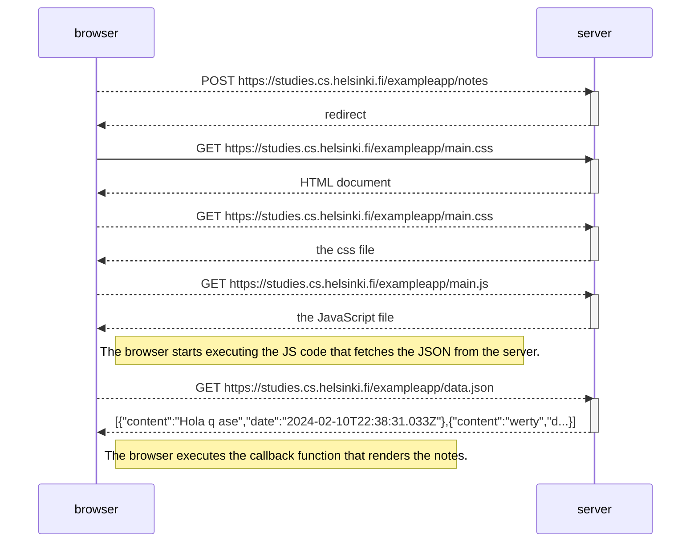

```mermaid

sequenceDiagram
  participant browser
  participant server

  browser-->>server: POST https://studies.cs.helsinki.fi/exampleapp/notes
  activate server 
  server-->>browser: redirect 
  deactivate server  

  browser->>server: GET https://studies.cs.helsinki.fi/exampleapp/main.css 
  activate server 
  server-->>browser: HTML document 
  deactivate server 

  browser-->>server: GET https://studies.cs.helsinki.fi/exampleapp/main.css 
  activate server 
  server-->>browser: the css file 
  deactivate server 

  browser-->>server: GET https://studies.cs.helsinki.fi/exampleapp/main.js 
  activate server 
  server-->>browser: the JavaScript file 
  deactivate server 

  Note right of browser: The browser starts executing the JS code that fetches the JSON from the server. 

  browser-->>server: GET https://studies.cs.helsinki.fi/exampleapp/data.json 
  activate server 
  server-->>browser: [{"content":"Hola q ase","date":"2024-02-10T22:38:31.033Z"},{"content":"werty","d...}] 
  deactivate server    

  Note right of browser: The browser executes the callback function that renders the notes. 
    
```
